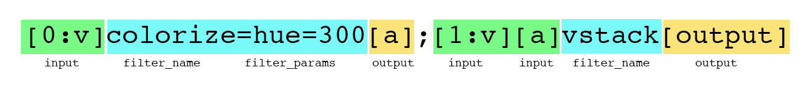

# FFMPEG

`ffmpeg` is a command line tool for manipulating media. It works with video, audio, and image formats.

## Installation

```
brew install ffmpeg
```

## Basics

An ffmpeg command usually takes an input, specified with the `-i` option, and then saves an output. The most basic usage is converting from one filetype to another like so:

```
ffmpeg -i input.mkv output.mp4
```

If you want to convert a video to an audio file, just change the extension of the output file to be `mp3`, `wav` or another audio file type:

```
ffmpeg -i input.mkv output.mp3
```

You can also make gifs:

```
ffmpeg -i input.mp4 output.gif
```

*Note making optimized gifs is actually a bit tricky. [Here's a nice guide.](https://engineering.giphy.com/how-to-make-gifs-with-ffmpeg/)*


Extract frames:

*Note: the `%08d` syntax indicates that ffmpeg should save the frames with numbers that are padded with 8 zeros*

```
ffmpeg -i input.mp4 frame%08d.jpg
```

## Trimming and extracting clips

To save a portion of video to a new file, use the `-ss` and `-t` options. `-ss` seeks to a timestamp, and `-t` specifies the length of time to extract.

For example, this seeks to 5 seconds, then extracts a 3 second clip:

```
ffmpeg -i input.mp4 -ss 5.0 -t 3.0 clip.mp4
```

You can specify times in seconds, or using traditional timestamps like `hh:mm:ss`.


## Specifying codecs

Most audio and video is compressed in some way. The algorithms that deal with compressing, and decompressing audio & video are called *codecs*. By default FFmpeg will try to intelligently chose a codec for you, but you can also specify which codec you'd like to use.

To get a list of all available codecs (it'll be a long list):

```
ffmpeg -codecs
```

To specify a codec, use `-c:v` for video, and `-c:a` for audio:

For example: 

```
ffmpeg -i input.avi -c:v libx264 output.mp4
```

You can also tell FFmpeg to copy the codec already in use:

```
ffmpeg -i input.mp4 -t 5.0 -c:v copy output.mp4
```

This generally makes things faster, but only works for certain operations.


## Filters

FFmpeg comes with a ton of audio and video filters. LINK

There are three ways to apply filters:

- `-vf` for video filters
- `-af` for audio filters
- `-filter_complex` for combining both and chaining together complex filters

A basic filter looks like this:

```
ffmpeg -i input.mp4 -vf "negate" out.mp4
```

This applies the "negate" filter to video, inverting its colors.

Some filters can take parameters, like `colorize`, which lets you change the hue, saturation, and lightness of a video. Here we're specifying that the `hue` of the video should be set to 200 (blue).

```
ffmpeg -i input.mp4 -vf "colorize=hue=200" out.mp4
```

Additional parameters can be added by separating them with a `:` character. Let's make the hue 200, and the saturation 0.2:

```
ffmpeg -i input.mp4 -vf "colorize=hue=200:saturation=0.22" out.mp4
```

You can chain multiple filters together with a `,` character. Here we'll use the `scale` filter to change the dimensions of the video to 200x200, and then apply colorize:

```
ffmpeg -i input.mp4 -vf "colorize=hue=200:saturation=0.22,scale=width=200:height=200" out.mp4
```


You can chain together as many filters as you want.


## Inputs and maps

A typical video file contains at least one audio stream and one video stream. Sometimes more! Based on what command you run, FFmpeg will try to automatically figure out which audio and video streams to use in the final output. You can also specify which streams to use manually using the `-map` option.

Each input you give to ffmpeg is given a numeric label. The first input is given the label "0" the second input "1", the third "2" and so on. To specify an audio or video stream, you use the input label, a ":" character, and then either "a" for audio or "v" for video. So, `0:v` means "get the video from the first input, and `0:a` means "get the audio from the first input.

For example, when converting from a video to audio file, FFmpeg will actually run the following command, just sending the audio and not video to the final file.

```
ffmpeg -i video.mp4 -map "0:a" audio.mp3
```

FFmpeg can take in multiple input files -- just add multiple `-i FILENAME` to the start of your command. By combining multiple inputs with the map command you can swap audio and video content from your files.

For example, the following command will create a new video taking the video content from the first input, and the audio content from the second input:

```
ffmpeg -i one.mp4 -i two.mp4 -map "0:v" -map "1:a" output.mp4
```


## Complex Filters

Some filters can take multiple inputs, or have multiple outputs. For example, the `vstack` filter stacks two videos vertically. In order to use filters like this, or to apply complex audio and video filters together, it's best to use the `-filter_complex` option. 

`-filter_complex` allows us to specify inputs and label outputs.

```
ffmpeg -i one.mp4 -i two.mp4 -filter_complex "[0:v][1:v]vstack[out_v]" -map "[out_v]" -map 0:a out.mp4
```

This is a complicated looking command! Let's break it down.

First, we are listing *two* inputs rather than one. As already noted, you can have as many input files as you'd like, just keep adding `-i INPUTNAME` to the start of the command. Here we have two videos `one.mp4` and `two.mp4`.

Second, you'll notice the strange square brackets at the start of the filter_complex option: `[0:v]`. These are the inputs for the filter. `0:v` means "get the *video* (thus the "v") from the first input, and `1:v` means get the video from the second input. Note that numbering starts with `0` not `1`.

After we specify the `vstack` filter we have another item in a square bracket, `[out_v]`. This is a label that *we* are specifying for the output of the filter, and we can call it anything we like.

Finally, we use the `-map` option to tell ffmpeg what we want to send to the output file. Here we are saying "use the output of vstack, which is called `out_v` and the audio from our first video, which is `0:a`.

## Filter labels

Let's look at an even more complicated example. Here we will take two input videos. We'll apply the `negate` filter to the first one, and the `colorize` filter to the second video, and then we will stack them vertically using `vstack`.

```
ffmpeg -i one.mp4 -i two.mp4 -filter_complex "[0:v]negate[a];[1:v]colorize=hue=100[b];[a][b]vstack[out_v]" -map "[out_v]" out.mp4
```

`[0:v]negate[a]`: send first video to the negate filter, and label the result "[a"]

`[1:v]colorize=hue=100[b]`: send the second video to the colorize filter and label the result "[b]"

`[a][b]vstack[out_v]`: send "[a]" and "[b]" to the vstack filter, and label the result "[out_v]"

`-map "[out_v]" out.mp4`: send "[out_v]" to the output file.

Generally speaking a complex filter looks something like this:



Because this all gets quite arcane and confusing, I suggest using [FFmpeg Explorer](https://ffmpeg.lav.io) when trying to make complex filter chains.


## A few examples

Here are a few more examples of some common things you might want to use ffmpeg for.


Convert images to video: 

```
ffmpeg -r 1 -pattern_type glob -i 'test_*.jpg' -c:v libx264 -pix_fmt yuv420p out.mp4
```

Images to video, with padding to fix different sizes:

```
ffmpeg -r 20 -pattern_type glob -i 'samfaces/*.jpg' -vf "scale=w=1280:h=720:force_original_aspect_ratio=1,pad=1280:720:(ow-iw)/2:(oh-ih)/2" -c:v libx264 -pix_fmt yuv420p out.mp4
```

Increase speed:

```
ffmpeg -i input.mp4 -vf "setpts=0.5*PTS" fastvideo.mp4
```

Decrease speed:

```
ffmpeg -i input.mp4 -vf "setpts=2.0*PTS" slowvid.mp4
```

Resize:

```
ffmpeg -i input.mp4 -c:v libx264 -s:v 100x100 -c:a copy output.mp4
```

Trim:

```
ffmpeg -ss 00:01:30 -i input.mp4 -c:v copy -c:a copy -t 5 output.mp4
```

Put all videos in a folder together

```
for f in *.mp4 ; do echo file \'$f\' >> list.txt; done && ffmpeg -f concat -safe 0 -i list.txt -s 1280x720 -crf 24 stitched-video.mp4 && rm list.txt
```

Fading in:

```
ffmpeg -i input.mp4 -vf "fade=in:0:30" output.mp4
```

Slow down a video with frame interpolation:

```
ffmpeg -i input.mp4 -vf ""[0:v]minterpolate=fps=120:mi_mode=mci[out];[out]setpts=5*PTS"" -y output.mp4
```

Overlay audio on to video:

```
ffmpeg -i input.mp4 -i input.mp3 -c copy -map 0:v:0 -map 1:a:0 output.mp4
```

Chromakey overlay:

```
ffmpeg -i background.mp4 -i foreground.mp4 -filter_complex "[1]colorkey=0xffffff:0.5:0.1[fg];[0][fg]overlay[out]" -map "[out]" together.mp4
```

Record from a webcam (on mac) for 10 seconds and save to file

```
ffmpeg -f avfoundation -pixel_format yuyv422 -framerate 30 -video_size 1280x720 -i 0:0 -t 00:00:10 -y webcamrecord.mp4
```
